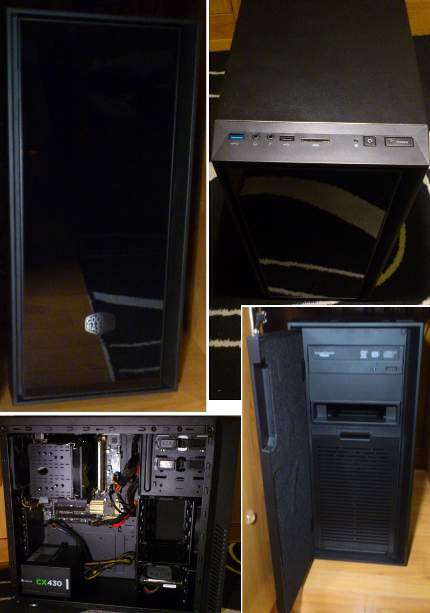

# Desktop Computer

 

* **Case :** [Cooler Master Silencio 550](https://eu.coolermaster.com/en/case/case-by-series/silencio-550/){: target="_blank" }
* **Motherboard :** [Asus H87M-PLUS C2](https://www.asus.com/Motherboards/H87MPLUS/){: target="_blank" }
* **CPU :** [Intel Core i7 4790K 4.00Ghz](https://ark.intel.com/products/80807){: target="_blank" }, originally [i3 4330 3.50Ghz](http://ark.intel.com/products/77769){: target="_blank" }
* **RAM :** [16GB - 2 x Ballistix Sport DDR3 8 GB 1600 MHz](http://www.crucial.com/usa/en/bls8g3d1609ds1s00){: target="_blank" }
* **Linux Storage:** [SanDisk SSD PLUS 240GB](https://www.google.com/search?q=SDSSDA-240G-G26){: target="_blank" } + [Samsung SSD 850 EVO 500GB](https://www.google.com/search?q=MZ-75E500B/EU){: target="_blank" }
* **Windows Storage:** [Crucial SSD 120GB](https://www.google.com/search?q=CT120M500SSD1){: target="_blank" } + [Seagate Barracuda 1TB](https://www.google.com/search?q=ST1000DM003){: target="_blank" }
* **Power supply :** [Corsair CX Bronze 430W](http://www.corsair.com/en-ww/cx430-80-plus-bronze-certified-power-supply){: target="_blank" }
* **Cooling :** [Thermalright Macho 120](http://thermalright.com/product/macho120-rev-a){: target="_blank" }
* **Fans :** [be quiet! Shadow Wings PWM 140 mm](http://www.bequiet.com/fr/casefans/264){: target="_blank" }
* **Graphic card :** [ATI Radeon HD 6450 1 GB](https://www.google.com/search?q=AMD+Radeon+HD+6450+1+GB+DDR3){: target="_blank" }
* **OS :** [Linux Mint 18.3 Cinnamon](https://linuxmint.com){: target="_blank" }

---
* **History :**
  * **January 2014 :** Initial build
  * **2015 :** 8GB RAM replaced by 16GB RAM
  * **2016-2017 :** Linux SSD storages added
  * **2018 :** i3 replaced by an i7

 

{: .img-thumbnail }
