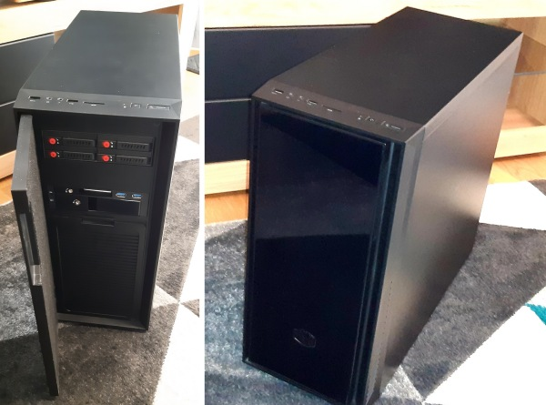
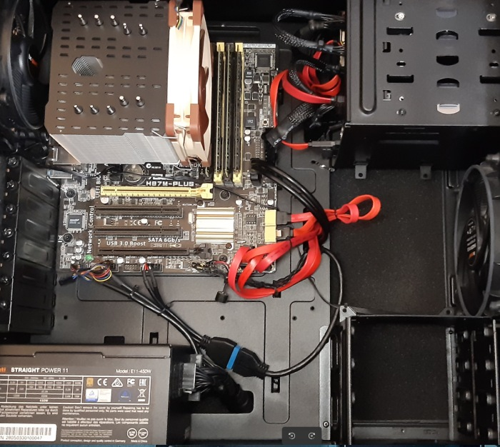

# Desktop Computer

 

* **Case :** [Cooler Master Silencio 550](https://www.coolermaster.com/catalog/legacy-products/cases/silencio-550/){: target="_blank" }
* **Motherboard :** [Asus H87M-PLUS C2](https://www.asus.com/Motherboards/H87MPLUS/){: target="_blank" }
* **CPU :** [Intel Core i7 4790K 4.00Ghz](https://ark.intel.com/products/80807){: target="_blank" }
* **RAM :** [32GB - 4 x Ballistix Sport DDR3 8 GB 1600 MHz](https://www.google.com/search?q=Ballistix+Sport+DDR3+8+GB+1600+MHz){: target="_blank" }
* **Linux Storage:** [Samsung SSD 850 EVO 500GB](https://www.google.com/search?q=MZ-75E500B/EU){: target="_blank" }
* **Power supply :** [Corsair CX Bronze 430W](https://www.corsair.com/us/en/Categories/Products/Power-Supply-Units/CX-SERIES/p/CP-9020046-NA){: target="_blank" }
* **Cooling :** [Thermalright Macho 120](http://thermalright.com/product/macho120-rev-a){: target="_blank" }
* **Fans :** [be quiet! Shadow Wings PWM 140 mm](http://www.bequiet.com/fr/casefans/264){: target="_blank" }
* **OS :** [Linux Ubuntu 22.10](hhttps://ubuntu.com){: target="_blank" }

---
* **History :**
  * **January 2014 :** Initial build
  * **2015 :** 8GB RAM replaced by 16GB RAM
  * **2016-2017 :** Linux SSD storages added
  * **2018 :** i3 4330 replaced by an i7 4790K
  * **2022 :** HD 6450 removed, using CPU's Intel HD 4600, upgraded to 32GB RAM

 

{: .img-thumbnail }

{: .img-thumbnail }
